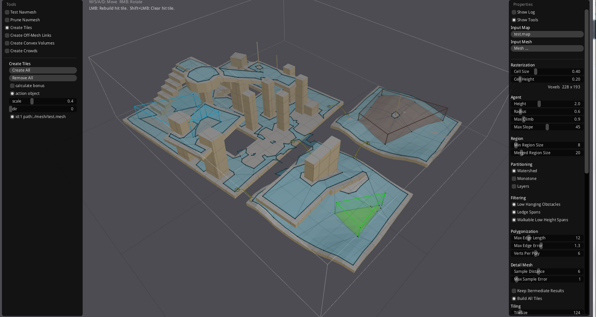

# recast-plus
recast navmesh导航网格，额外增加动态模型功能，能动态更新区域的导航网格。  
另外增加了对模型OBJ文件的二进制封装，对地图文件的二进制封装，加快文件的读取速度。 
plus目录是相关的新增模块管理，如果需要使用运行时的动态生成navmesh，请使用NavRuntime.h这个文件里的管理类 
支持在运行时，能够在一个子线程重新更新区域的navmesh，并且产生回调通知主线程 
tool工具用来生成自定义的格式，来加快程序的读取文件和处理数据的速度 
另外新增一个demo来演示相关的功能。 

 
